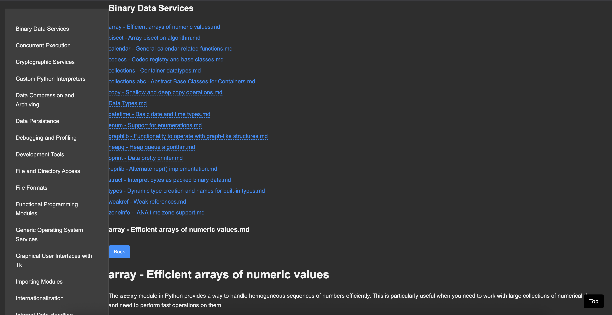
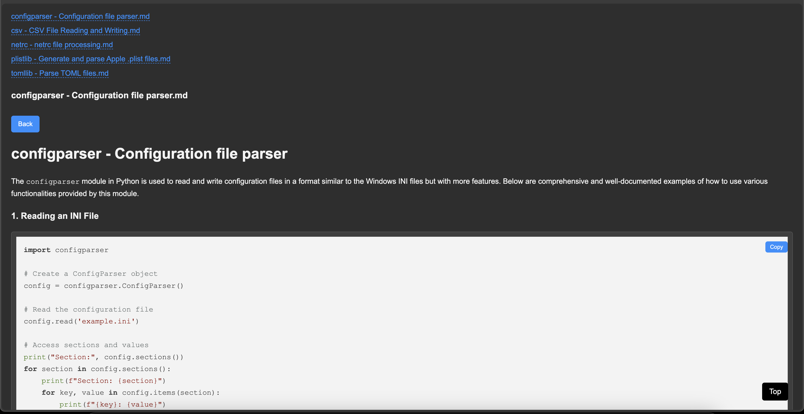
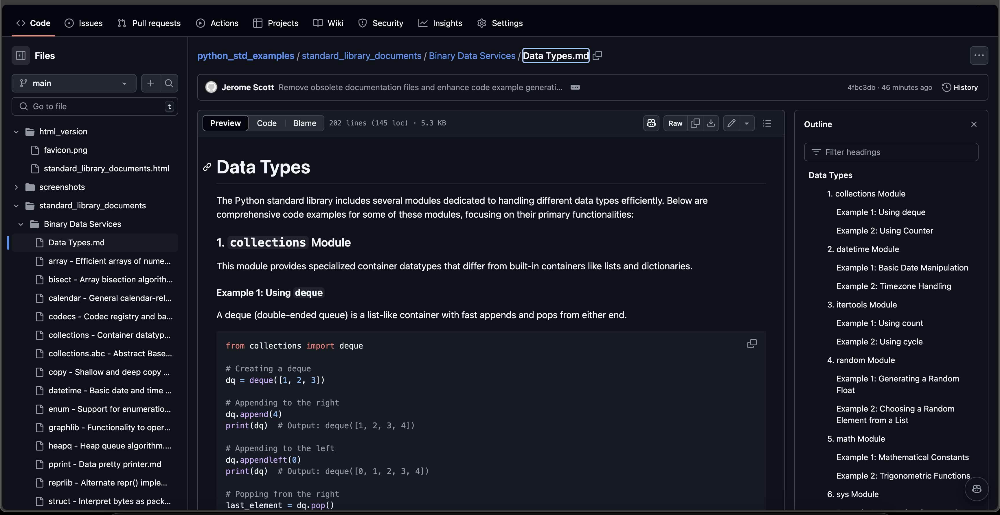

Python standard library code examples using AI

This application generates code examples for Python's standard library modules using AI. The code examples are generated using the qwen2.5-coder:3b model.

## How to Use

1. Ensure you have the necessary dependencies installed.
2. Make sure the `ollama` service is running.
3. Run the `main.py` script to generate the code examples.

4. The generated markdown files will be saved in the `standard_library_documents` directory.
5. . If files already exist, they will not be replaced or processed. You can delete the existing files and run the program again to regenerate them.
6. You can add more modules to the standard library dictionary to generate examples for additional modules.
7. **Generate HTML Version:** Run the `create_html_version.py` script to convert the generated markdown files into a single HTML document. This HTML file will be saved in the `html_version` folder and will include categorized links and a scroll-to-top button for easy navigation.
   
   
   

## Application Demo

Check out the demo of this application [here](https://codefreelance.net/apps/python_std_bible/).

### Development Notes

You can use Copilot edits to refactor the `standard_library_documents` to improve examples if needed.
